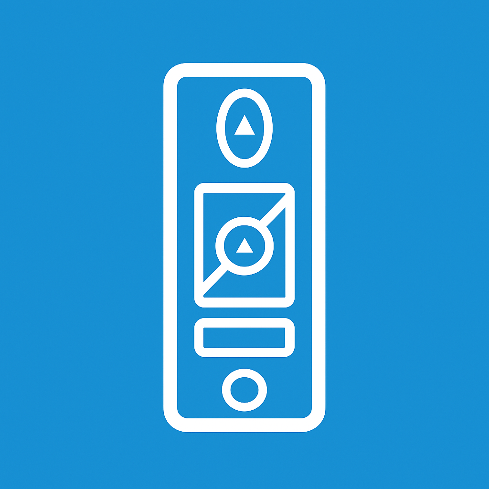

# Pico Link

### A Lutron Pico → Home Assistant Device Controller

[](https://hacs.xyz)  
  


---

## 🌟 Overview

**Pico Link** is a lightweight Home Assistant integration that turns **Lutron
Caseta Pico remotes**—including the **new paddle Pico**—into entity controllers.

<p align="center">
  
</p>

Pico Link listens directly to:

```

lutron_caseta_button_event

```

and provides:

- tap/short-press behavior
- hold detection with step / ramp logic
- scene execution (4B)

Supported Pico types:

- **P2B** (Paddle Pico)
- **2B** (Two-Button Pico)
- **3BRL** (Raise / Lower with middle button)
- **4B** (Scene Pico)

---

## 🚀 Installation

### 📦 HACS (Recommended)

1. Go to **HACS → Integrations**
2. Click **⋮ → Custom Repositories**
3. Add:

```

https://github.com/smartqasa/pico-link

```

4. Choose **Integration**
5. Search for **Pico Link** and install it
6. Restart Home Assistant

---

## 📁 Manual Installation

Copy the `pico_link/` folder into:

```

config/custom_components/pico_link/

```

Restart Home Assistant.

---

# ⚙️ Configuration Structure

Each device must include:

- `type:` — one of **P2B, 2B, 3BRL, 4B**
- either `device_id:` or `name:`
- for all **non-4B** devices → **at least one of:**

```

lights: fans: covers: switches: media_players:

```

- for **4B** → only `buttons:` is required
- optional `defaults:` block

---

# 📊 Configuration Parameters

| Parameter         | Type              | Required?                   | Default | Description                             |
| ----------------- | ----------------- | --------------------------- | ------- | --------------------------------------- |
| **type**          | string            | **Required**                | —       | One of: `P2B`, `2B`, `3BRL`, `4B`.      |
| **name**          | string            | Optional                    | —       | Used if `device_id` not provided.       |
| **device_id**     | string            | Optional                    | —       | HA device registry ID.                  |
| **lights**        | list              | Optional                    | `[]`    | Light entities controlled by the Pico.  |
| **fans**          | list              | Optional                    | `[]`    | Fan entities the Pico controls.         |
| **covers**        | list              | Optional                    | `[]`    | Cover entities (blinds, shades).        |
| **switches**      | list              | Optional                    | `[]`    | Switch entities.                        |
| **media_players** | list              | Optional                    | `[]`    | Media player entities.                  |
| **middle_button** | list or `default` | Only for `3BRL`             | `[]`    | If `default`, inherits global defaults. |
| **buttons**       | mapping           | Required only for type `4B` | `{}`    | Maps button names → action lists.       |
| **hold_time_ms**  | integer           | Optional                    | `250`   | Hold detection delay.                   |
| **step_time_ms**  | integer           | Optional                    | `750`   | Ramp update interval.                   |
| **step_pct**      | integer           | Optional                    | `10`    | Ramp step size.                         |
| **low_pct**       | integer           | Optional                    | `1`     | Minimum brightness during ramp-down.    |
| **on_pct**        | integer           | Optional                    | `100`   | Brightness used for ON.                 |
| **fan_speeds**    | integer           | Optional                    | `6`     | Number of discrete fan speeds.          |

---

# 🔝 Required Parameters By Pico Type

| Pico Type | Requires `entities`? | Requires `buttons`? | Allows `middle_button`? | Hold/Ramp? |
| --------- | -------------------- | ------------------- | ----------------------- | ---------- |
| **P2B**   | ✔ Yes               | ✘ No                | ✘ No                    | ✔ Yes     |
| **2B**    | ✔ Yes               | ✘ No                | ✘ No                    | ✘ No       |
| **3BRL**  | ✔ Yes               | ✘ No                | ✔ Yes                  | ✔ Yes     |
| **4B**    | ✘ No                 | ✔ Yes              | ✘ No                    | ✘ No       |

A **non-4B** device must include **at least one** of:

```

covers, fans, lights, media_players, switches


```

---

# 🔝 Example Configurations

## ✔ P2B (Paddle Pico)

```yaml
pico_link:
  devices:
    - device_id: 1551fa9867f7b1e58790823d6b92d911
      type: P2B
      lights:
        - light.bedroom_lights
```

---

## ✔ 2B (Two-Button Pico)

```yaml
pico_link:
  devices:
    - name: Bedside Pico
      type: 2B
      switches:
        - switch.bedside_lamp
```

---

## ✔ 3BRL (Three-Button Raise/Lower)

```yaml
pico_link:
  defaults:
    hold_time_ms: 250
    step_pct: 10
    step_time_ms: 1000
    on_pct: 100
    low_pct: 1
    middle_button:
      - action: light.turn_on
        target:
          entity_id: lights
        data:
          brightness_pct: 80
          kelvin: 2800

  devices:
    - name: Living Room Remote
      type: 3BRL
      lights:
        - light.living_room_lights
      middle_button: default

    - name: Dining Room Remote
      type: 3BRL
      lights:
        - light.dining_room_lights
      middle_button:
        - action: light.turn_on
          target:
            entity_id: light.dining_room_lights
          data:
            brightness_pct: 50
```

---

## ✔ 4B (Scene Pico)

```yaml
pico_link:
  devices:
    - name: Scene Remote
      type: 4B
      buttons:
        button_1:
          - action: scene.turn_on
            target:
              entity_id: scene.movie
        button_2:
          - action: script.dim_lights
        button_3:
          - action: light.turn_off
            target:
              entity_id: light.kitchen_lights
        off:
          - action: homeassistant.turn_off
            target:
              area_id: living_room
```

---

# 🧩 Placeholder Expansion

Inside **3BRL** `middle_button:` definitions, the following placeholders are
supported:

| Placeholder     | Expands To              |
| --------------- | ----------------------- |
| `covers`        | List from device config |
| `fans`          | List from device config |
| `lights`        | List from device config |
| `media_players` | List from device config |
| `switches`      | List from device config |

### Example:

```yaml
entity_id: lights
```

or:

```yaml
entity_id:
  - lights
  - media_players
  - light.extra_lamp
```

The integration expands this into a real entity list automatically.

---

# ☕ Support Development

<a href="https://buymeacoffee.com/smartqasa" target="_blank">
  
</a>
