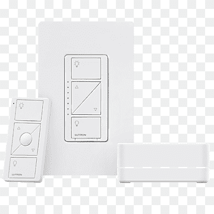

# 🌟 **Pico Link**

### _A Universal Lutron Pico → Home Assistant Device Controller_

[](https://hacs.xyz)


<p align="center">
  
</p>

---

## 🧠 Overview

**Pico Link** turns any **Lutron Caséta Pico Remote** into a **native,
domain-aware Home Assistant controller**.

It listens directly to:

```text
lutron_caseta_button_event
```

and provides:

- Tap vs hold detection
- Step vs ramp behavior
- Domain-specific logic (lights, fans, covers, media players, switches)
- STOP button semantics (3BRL)
- Scene execution (4-button Picos)
- Placeholder expansion for device-scoped actions

---

## 🧭 Supported Pico Types

| Pico Type | Layout                         | Buttons                               | Hold | STOP         | Typical Use                 | Notes                |
| --------- | ------------------------------ | ------------------------------------- | ---- | ------------ | --------------------------- | -------------------- |
| **P2B**   | Paddle                         | `on`, `off`                           | ✔   | Logical only | Lights, fans, covers, media | Raise/lower inferred |
| **2B**    | On/Off                         | `on`, `off`                           | ✘    | ✘            | Simple switches             | Tap only             |
| **3BRL**  | On / Raise / Stop /Lower / Off | `on`, `raise`, `stop`, `lower`, `off` | ✔   | ✔           | Full device control         | STOP is domain-aware |
| **4B**    | 4 Scenes                       | `button_1…3`, `off`                   | ✘    | ✘            | Scenes / scripts            | No domain logic      |

---

## 🚀 Installation

### 📦 HACS (Recommended)

1. **HACS → Integrations**
2. **⋮ → Custom Repositories**
3. Add:

   ```
   https://github.com/smartqasa/pico-link
   ```

4. Type: **Integration**
5. Install **Pico Link**
6. Restart Home Assistant

### 📁 Manual

Copy into:

```text
config/custom_components/pico_link/
```

Restart Home Assistant.

---

## ⚙️ Configuration Structure

```yaml
pico_link:
  defaults: # optional
  devices: # required
```

Each **device entry** must define:

- `type`
- `name` **or** `device_id`
- **Exactly one domain** (except 4B)

Valid domains:

```text
lights:
fans:
covers:
media_players:
switches:
```

4-button Picos use `buttons:` instead of a domain.

---

## ⏱ Timing Defaults — READ THIS FIRST

Pico Link relies on **time-based heuristics** to distinguish:

- Tap vs hold
- Step vs ramp

These values are **behavior-critical**, not cosmetic.

### ⚠️ Important

> **If you are unsure, do not override timing defaults.** Poor values can cause
> missed taps, runaway ramps, or unexpected STOP behavior.

### Built-In Defaults

| Parameter      | Default | Purpose              |
| -------------- | ------- | -------------------- |
| `hold_time_ms` | `400`   | Tap → Hold threshold |
| `step_time_ms` | `750`   | Ramp repeat interval |

### Safe Override Ranges

```text
hold_time_ms: 300–500
step_time_ms: 600–1000
```

Values outside these ranges are discouraged.

---

## 📊 Configuration Parameters

| Field                   | Required       | Default        | Description             |
| ----------------------- | -------------- | -------------- | ----------------------- |
| `type`                  | ✔             | —              | Pico hardware type      |
| `name` / `device_id`    | ✔             | —              | Pico identity           |
| Domain (`lights`, etc.) | ✔ (except 4B) | —              | Controlled entities     |
| `buttons`               | 4B only        | `{}`           | Scene/action mappings   |
| `middle_button`         | 3BRL only      | domain default | STOP behavior           |
| `hold_time_ms`          | optional       | `400`          | Hold threshold (millis) |
| `step_time_ms`          | optional       | `750`          | Ramp interval (millis)  |
| `cover_open_pos`        | optional       | `100`          | ON open position (pct)  |
| `cover_step_pct`        | optional       | `10`           | Cover step (pct)        |
| `fan_on_pct`            | optional       | `100`          | ON speed (pct)          |
| `light_on_pct`          | optional       | `100`          | ON brightness (pct)     |
| `light_low_pct`         | optional       | `5`            | Minimum dim (pct)       |
| `light_step_pct`        | optional       | `10`           | Step size (pct)         |
| `light_transition_on`   | optional       | `0`            | Fade-in time (seconds)  |
| `light_transition_off`  | optional       | `0`            | Fade-out time (seconds) |
| `media_player_vol_step` | optional       | `10`           | Volume step (pct)       |

### Light Transitions

`light_transition_on` and `light_transition_off` control **smooth fades** when
lights are turned ON or OFF via tap actions.

- Value is in **seconds**
- When set to `0`, the transition parameter is **not sent** to Home Assistant
- Transitions apply to **tap ON / OFF only**
- Step and ramp actions are always instant for responsiveness

---

## 🛑 STOP / Middle Button Behavior (3BRL)

STOP behavior is **explicit and deterministic**.

### Resolution Order

1. Device `middle_button`
2. Global default `middle_button` (if set to `default`)
3. Domain default behavior

### Valid Forms

```yaml
middle_button: []        # use domain default
middle_button: default   # use global default
middle_button:           # explicit custom actions
  - action: ...
```

### Domain Default STOP Actions

| Domain        | STOP Behavior     |
| ------------- | ----------------- |
| Covers        | Stop Cover        |
| Fans          | Reverse direction |
| Lights        | No-op             |
| Media Players | Toggle mute       |
| Switches      | No-op             |

---

## 🧩 Placeholder Expansion (3BRL)

Within `middle_button:` actions, these placeholders expand automatically:

| Placeholder     | Expands To             |
| --------------- | ---------------------- |
| `covers`        | Assigned covers        |
| `fans`          | Assigned fans          |
| `lights`        | Assigned lights        |
| `media_players` | Assigned media players |
| `switches`      | Assigned switches      |

Example:

```yaml
target:
  entity_id:
    - lights
    - light.accent_lamp
```

---

## 🎮 Domain Behavior Summary

### 💡 Lights

| Button | Action                   |
| ------ | ------------------------ |
| ON     | turn_on → `light_on_pct` |
| OFF    | turn_off                 |
| RAISE  | step / ramp up           |
| LOWER  | step / ramp down         |
| STOP   | no-op                    |

### 🌀 Fans

| Button | Action                        |
| ------ | ----------------------------- |
| ON     | set_percentage → `fan_on_pct` |
| OFF    | turn_off                      |
| RAISE  | step / ramp up                |
| LOWER  | step / ramp down              |
| STOP   | reverse_direction             |

### 🪟 Covers

| Button | Action                  |
| ------ | ----------------------- |
| ON     | open → `cover_open_pos` |
| OFF    | close                   |
| RAISE  | step / ramp open        |
| LOWER  | step / ramp close       |
| STOP   | stop_cover              |

### 🎵 Media Players

| Button | Action            |
| ------ | ----------------- |
| ON     | play / play_pause |
| OFF    | next_track        |
| RAISE  | volume up         |
| LOWER  | volume down       |
| STOP   | mute / unmute     |

### 🔌 Switches

| Button | Action   |
| ------ | -------- |
| ON     | turn_on  |
| OFF    | turn_off |
| Others | no-op    |

---

## 📘 SAMPLE CONFIGURATION

```yaml
pico_link:
  defaults:
    # Optional global STOP behavior (3BRL)
    middle_button:
      - action: light.turn_on
        target:
          entity_id: lights
        data:
          brightness_pct: 80
          transition: 1

  devices:
    # P2B Paddle — lights
    - name: Kitchen Paddle
      type: P2B
      lights:
        - light.kitchen_main
      light_transition_on: 1
      light_transition_off: 3

    # 2B — switch
    - name: Closet Pico
      type: 2B
      switches:
        - switch.closet_light

    # 3BRL — lights, uses global STOP
    - name: Bedroom Remote
      type: 3BRL
      lights:
        - light.bedroom_main
        - light.bedroom_lamps
      middle_button: default

    # 3BRL — fan, custom STOP
    - name: Living Room Fan
      type: 3BRL
      fans:
        - fan.living_room
      fan_on_pct: 40

    # 3BRL — cover, domain STOP
    - name: Shade Remote
      type: 3BRL
      covers:
        - cover.living_room_shade

    # 3BRL — media player
    - name: Office Media
      type: 3BRL
      media_players:
        - media_player.office_sonos
      media_player_vol_step: 5

    # 4B — scenes
    - name: Scene Pico
      type: 4B
      buttons:
        button_1:
          - action: scene.turn_on
            target:
              entity_id: scene.movie
        button_2:
          - action: script.dim_lights
        button_3:
          - action: light.turn_off
            target:
              entity_id:
                - light.kitchen
                - light.living_room
        off:
          - action: homeassistant.turn_off
            target:
              area_id: main_floor
```

---

## 🛡 Validation & Safety

Pico Link enforces:

- One domain per device (except 4B)
- Valid Pico types
- Correct STOP usage
- Valid numeric ranges
- Clear, actionable config errors

---

## ☕ Support Development

<a href="https://buymeacoffee.com/smartqasa" target="_blank">
  
</a>

---
